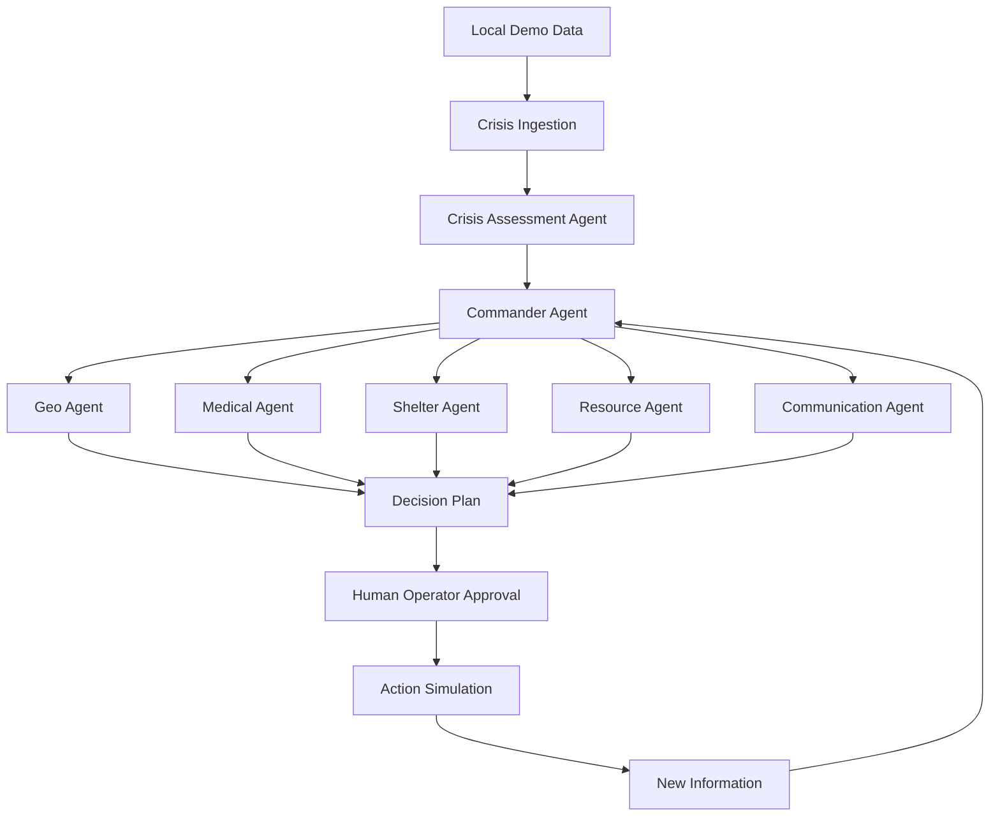

# CrisisMind AI

CrisisMind AI is a functional flood-response decision-support prototype for a simulated Vijayawada incident. It combines deterministic domain agents, a commander workflow, live WebSocket activity, Leaflet mapping, explainable recommendations, operator approval, replanning, alerts, audit history, and simulation controls. It does not control emergency infrastructure; critical actions remain human-approved.

## Problem and MVP
Emergency operators need a shared picture of flood severity, safe routes, shelter capacity, medical capacity, and deployable resources. This MVP uses local structured data so the full demo works without MongoDB, paid map APIs, weather APIs, or an LLM key.

## Architecture


## Agents
- Assessment calculates severity, evacuation need, priority zones, and medical risk.
- Geo excludes blocked roads and reports open simulated routes.
- Shelter ranks capacity, accessibility, and route suitability.
- Medical ranks supplied hospitals by ICU and available beds.
- Resource allocates available buses by scenario and assignment.
- Communication provides English, Telugu, and Hindi demo alerts.
- Commander assembles recommendations, explanations, confidence, alternatives, and approval state.

## Stack
React, TypeScript, Vite, Tailwind CSS, Lucide React, React Leaflet, Recharts; FastAPI, Pydantic, WebSockets, LangGraph-compatible workflow module; in-memory demo persistence with optional MongoDB/LLM environment hooks.

## Install and run
Backend (Windows PowerShell):
```powershell
cd backend
python -m venv .venv
.venv\Scripts\activate
pip install -r requirements.txt
uvicorn app.main:app --reload --port 8000
```

Frontend in a second terminal:
```powershell
cd frontend
npm install
npm run dev
```

Open http://localhost:5173. Backend docs: http://localhost:8000/docs. `start.bat` launches both terminals after the backend virtual environment is created.

## Environment
Copy `backend/.env.example` if desired. Empty values are supported:
`MONGODB_URI`, `LLM_API_KEY`, `LLM_MODEL`, and `CORS_ORIGINS`.

## Two-minute demo
1. Open the dashboard. It starts at **No Active Crisis** and shows standby agents.
2. Click **Trigger Flood**. Watch agent activity, the Vijayawada map, and Response Plan v1 appear.
3. Review the explainability section, then click **Approve Plan**.
4. Click **Block Road**. Road A-B changes to BLOCKED, events stream in, and v2 shows route, shelter, and bus changes.
5. Approve the new plan and switch the citizen alert language between English, Telugu, and Hindi.
6. Inspect the operational timeline and use Swagger for the audit/metrics endpoints.

## API
`GET /api/health`, `/api/crisis/current`, `/api/agents/status`, `/api/resources`, `/api/shelters`, `/api/hospitals`, `/api/routes`, `/api/audit-log`, `/api/metrics`; POST `/api/crisis/trigger`, `/api/crisis/reset`, `/api/plan/generate`, `/api/plan/approve`, `/api/plan/reject`, `/api/replan`, `/api/simulation/block-road`, `/api/simulation/new-report`; WebSocket `/ws/crisis`.

## Safety and limitations
This is a simulation and decision-support prototype. Values come from the supplied demo dataset; metrics are simulation values, not operational performance claims. Authentication is represented by the demo Emergency Operator role. The current UI prioritizes the dashboard view; API endpoints expose the full audit and metrics data for the expo flow. OpenStreetMap tiles require network access to render tiles, but the app itself does not require a paid map API or LLM.

## Future improvements
Add durable event storage, real role-based authentication, richer shortest-path routing, configurable scenarios, validated LLM explanations behind a feature flag, and accessibility/localization review with emergency operators.
