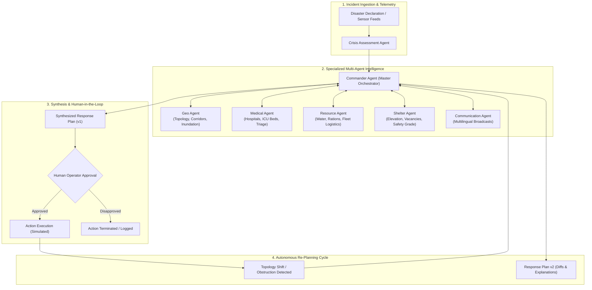

# CRISIS MIND — AI CRISIS COMMAND CENTER
> **Autonomous Multi-Agent Disaster Response, Explainable Planning & Human-in-the-Loop Simulation Platform**

[](https://fastapi.tiangolo.com)
[](https://reactjs.org/)
[](https://www.typescriptlang.org/)
[](https://vitejs.dev/)
[](https://leafletjs.com/)
[](https://render.com)

---

## 📌 Executive Summary
**CrisisMind AI** is an emergency decision-support prototype designed for disaster command centers. It demonstrates how **Agentic AI**—a network of 7 specialized autonomous agents coordinated by a Master Commander—can assess disasters, evaluate hospital & shelter capacities, calculate safe evacuation corridors, detect supply bottlenecks, and formulate explainable action plans with **Human-in-the-Loop approval gates**.

> [!IMPORTANT]
> **Safety & Simulation Disclaimer:** This prototype is an AI decision-support platform operating on simulated municipal telemetry. Critical emergency directives (road closure, triage intake, resource dispatch) are **simulated within the software** and strictly require human authorization before simulation execution.

---

## 🏛️ System Architecture



---

## 🤖 Specialized Agent Network

| Agent Name | Role | Responsibilities & Outputs |
| :--- | :--- | :--- |
| **Commander Agent** | Central Orchestrator & Planner | Aggregates multi-agent telemetry, prioritizes tactical directives with confidence scoring, explains rationales, and triggers autonomous re-planning cycles. |
| **Crisis Assessment Agent** | Severity Scoring & Demographics | Computes composite disaster severity index (LOW to CRITICAL), classifies exposed demographics, and sets operational priority zones. |
| **Geo Agent** | Geospatial Topology & Routing | Analyzes road networks against hydrological inundation, isolates submerged roads, and computes safe green evacuation transit corridors. |
| **Shelter Agent** | Shelter Capacity Matching | Audits shelter elevation, structural safety grades, and capacity headroom; matches displaced zone populations to optimal safe receiving facilities. |
| **Medical Agent** | Hospital Capacity & Trauma Readiness | Audits regional hospital beds, ICU units, and active ambulances; estimates casualty surge and reserves acute trauma intake beds. |
| **Resource Agent** | Inventory & Logistics Dispatch | Audits stock levels for Potable Water, Rations, Trauma Kits, Rescue Boats, and Transit Buses; detects deficits and formulates logistics convoys. |
| **Communication Agent** | Multilingual Public Broadcasts | Synthesizes verified citizen advisories in **English**, **Telugu**, and **Hindi** for SMS gateways, sirens, and broadcast networks. |

---

## 🌐 Multi-Location Demonstration Theaters
The system features distinct real-world geographical datasets across 7 major operational theaters:
1. **Vijayawada, Andhra Pradesh**: Flash Flooding & Krishna River Breaches.
2. **Hyderabad, Telangana**: Urban Cloudburst, Inundated Underpasses & Drain Overflows.
3. **Delhi NCR**: Extreme Heatwave, Toxic AQI Surge & Trauma Hospital Stress.
4. **Mumbai, Maharashtra**: Coastal Cyclone Storm Surge & Rail/Road Waterlogging.
5. **Visakhapatnam, Andhra Pradesh**: Coastal Cyclone Gale & Port Zone Evacuations.
6. **Chennai, Tamil Nadu**: Monsoon Inundation & Lowland Basin Relief.
7. **Bengaluru, Karnataka**: Heavy Precipitation, Tech Corridor Roadblockages & Lake Overflows.

---

## 🚀 1-Click Expo Demonstration Flow
When presenting to judges or operators:
1. **Click `[ ▶ START DEMO ]`** on the top bar.
2. Observe the **Live Agent Activity Monitor** stream progressive events with real-time status badges (`RUNNING`, `COMPLETED`, `WARNING`, `APPROVED`).
3. Click any agent in the **Agent Network** panel to open the **Agent Detail Inspector Modal** (Role, Task, Input, Reasoning Process Steps, Deliverables, Telemetry).
4. Review the generated **Tactical Directives (Response Plan v1)** with Priority badges (`CRITICAL`, `HIGH`, `MEDIUM`, `LOW`), Confidence meters, and Explainability notes.
5. Click **`[ ✓ Approve Action ]`** on any recommendation:
   - Status updates to `APPROVED & SIMULATED`.
   - Environmental state mutates (road obstructed, resources allocated).
   - Commander Agent detects state change and triggers **Autonomous Re-planning (Response Plan v2)** with visual change diffs.
6. Explore the **Multilingual Alert Center** for English, Telugu, and Hindi broadcasts.
7. Use **Export Logs (JSON)** in the persistent Audit Log panel to download the complete session audit trail.

---

## 💻 Local Quickstart

### Prerequisites
- **Python 3.10+**
- **Node.js 18+** & **npm**

### Option A: 1-Click Windows Launcher
Run `start.bat` in the root directory. It will start both the FastAPI backend (port 8000) and the React frontend (port 5173).

### Option B: Manual Terminal Execution

#### 1. Backend Service
```powershell
cd backend
python -m venv .venv
.venv\Scripts\activate
pip install -r requirements.txt
uvicorn app.main:app --reload --port 8000
```
*API Swagger Docs:* `http://localhost:8000/docs`

#### 2. Frontend Application
```powershell
cd frontend
npm install
npm run dev
```
*Frontend UI:* `http://localhost:5173`

---

## ☁️ Public Deployment on Render

### Backend Web Service (Python)
- **Environment:** Python 3
- **Root Directory:** `backend`
- **Build Command:** `pip install -r requirements.txt`
- **Start Command:** `uvicorn app.main:app --host 0.0.0.0 --port $PORT`
- **Environment Variables:**
  - `CORS_ORIGINS`: `*` (or your frontend Render URL)
  - `LLM_API_KEY`: *(Optional - Gemini API Key)*

### Frontend Static Site (Vite / React)
- **Root Directory:** `frontend`
- **Build Command:** `npm install && npm run build`
- **Publish Directory:** `dist`
- **Environment Variables:**
  - `VITE_API_URL`: `https://your-backend-service.onrender.com`

---

## 🛡️ License
CrisisMind AI is developed for emergency response decision support and AI exposition demonstrations. Distributed under the MIT License.

